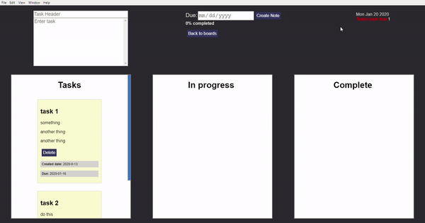

# vue-electron-stickyboard
This is a minimal project board application built with Vue.js and Electron. App data is saved in local storage.
Tasks can be added to the task board and dragged over to the other columns as needed. A task passed it's due date will show a warning to the user.



## Project setup
```
npm install
```

### Compiles and hot-reloads for development
```
npm run electron:serve
```

### Compiles and minifies for production
```
npm run electron:build
```

### Customize configuration
See [Configuration Reference](https://cli.vuejs.org/config/).
