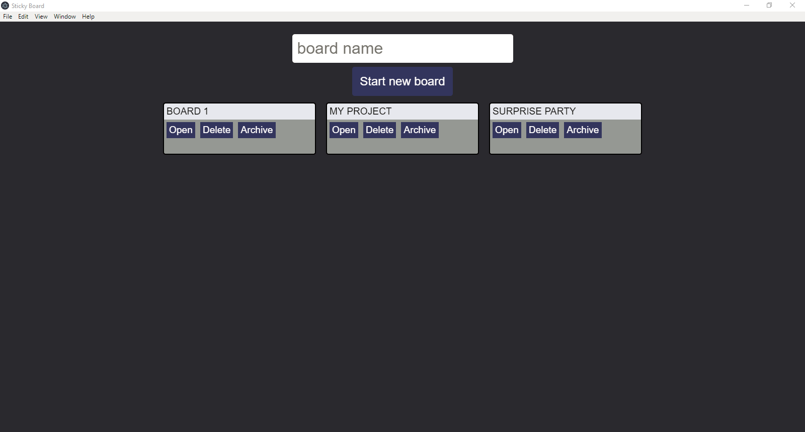
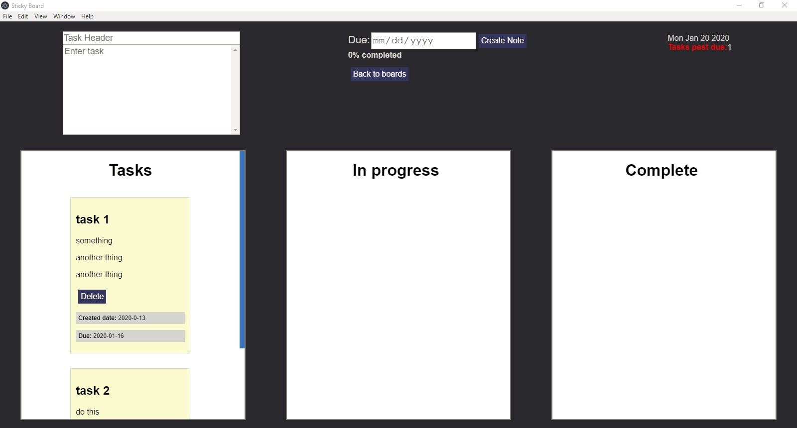
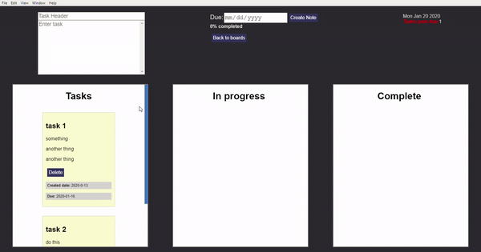

# vue-electron-stickyboard
This is a minimal project board application built with Vue.js and Electron. App data is saved in local storage.
Tasks can be added to the task board and dragged over to the other columns as needed. A task passed it's due date will show a warning to the user.








Tasks can be dragged and dropped to other columns as needed.


In a project board if any of the tasks are passed their due date a warning will show up in the top right corner.
The user can click to see which tasks have gone beyond their due date.


As tasks are entered into the "complete" column a progress bar shows the percentage of complete tasks.

More functionality will be added in the near future...

## Project setup
```
npm install
```

### Compiles and hot-reloads for development
```
npm run electron:serve
```

### Compiles and minifies for production
```
npm run electron:build
```

### Customize configuration
See [Configuration Reference](https://cli.vuejs.org/config/).
